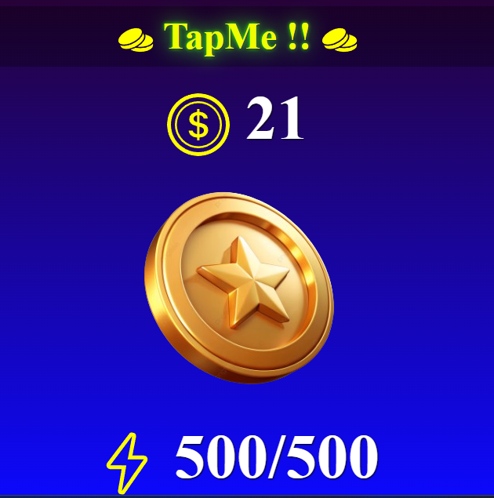

# 🧩 TapMe Frontend

This repository contains the frontend code for the TapMe project. It features a React application that interacts with a Telegram bot and a Supabase database. Users can start a game, view their coin balance, and interact with the game to update their coin balance.

## 📸 App Interface



## 🛠️ Technologies Used

- **React:** JavaScript library for building user interfaces.
- **Apollo Client:** Library for managing GraphQL data and state.
- **GraphQL:** Query language for APIs.
- **CSS Modules:** For modular and scoped CSS styling.
- **React Icons:** To add icons to the UI.

## 🛠️ Installation 

To run this project locally, follow these steps:

1. Clone the repository.
2. Navigate to the project directory:
```
cd frontend
```
3. Install the necessary dependencies:

```
npm install
```

4. Run the project.

```
npm start
```

## 📖 Approach

### Frontend Architecture

- **Component Structure:** 
  - The application consists of functional React components that utilize hooks for managing state and side effects.
- **State Management:** 
  - Employs React's `useState` and `useEffect` hooks to handle local component state and manage side effects.
- **GraphQL Integration:** 
  - Utilizes Apollo Client to interact with the GraphQL API for data fetching and management.
- **Routing:** 
  - Retrieves query parameters from the URL to pass data to components, specifically extracting the `telegramId` to interact with the `CoinCounter` component.

### Key Components

- **`App` Component:**
  - Serves as the main entry point of the application.
  - Retrieves the `telegramId` from the URL and passes it as a prop to the `CoinCounter` component.
- **`CoinCounter` Component:**
  - Displays and manages the user's coin balance.
  - Allows users to interact with the game and update their coin balance by clicking a button.

### 📜 File Structure

- **`src/`**: Contains all source files for the project.
  - **`components/`**: Contains React components used in the application.
  - **`assets/`**: Houses static assets such as images.
  - **`apolloClient.ts`**: Configuration for Apollo Client.
  - **`App.tsx`**: The main application component.
  - **`index.tsx`**: The entry point for the React application.
  - **`styles/`**: Contains CSS modules for styling components.


## 👩‍💻 Authors

- [@Snehal](https://github.com/Snehal-Salvi)


